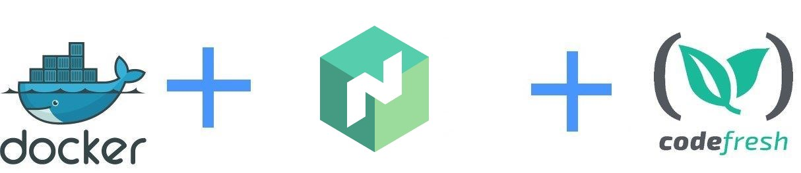

# Deploying to a Nomad cluster with Codefresh

This is an example Nomad deployment that runs in a Codefresh pipeline using docker.
More details can be found in [the documentation page](https://codefresh.io/docs/docs/yaml-examples/examples/nomad).

Original source: https://github.com/callicoder/go-docker

## Build locally

Normal docker build 

`docker build . -t go-sample-app`

## Run locally

`docker run -p 8080:8080 go-sample-app`

and then visit in your browser

* http://localhost:8080/
* http://localhost:8080/?name=John

## Build in Codefresh

Sample pipeline:

* [Simple pipeline](codefresh.yml)
* [Job template](docker-job.hcl)

Read also the [Codefresh Registry docs](https://codefresh.io/docs/docs/docker-registries/codefresh-registry/#generate-cfcr-login-token) for more details on accessing the registry from your Nomad cluster.

